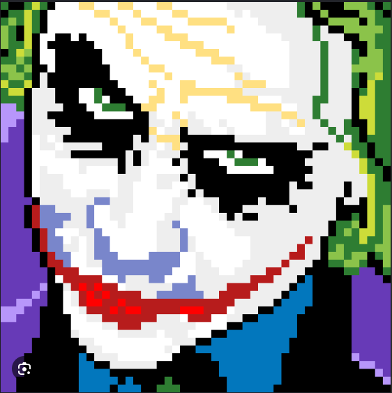
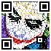
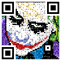

<div align="center">

# 👾 QR Code Pixel Art

[](https://www.python.org/downloads/)
[](https://github.com/astral-sh/uv)

*This project is a Python-based generator inspired by a [Reddit tutorial](https://www.reddit.com/r/PixelArt/comments/1v52x96/tutorial_turn_pixel_art_into_a_working_qrcode/). It automates the process of turning standard pixel art into fully scannable, stylized QR codes.*

</div>

---

## ⚙️ How it works

The algorithm follows a simple three-step process based on the original tutorial:

### 1. Split the QR Code into Three Layers
The generated QR code is divided into specific functional masks:

| Layer | Description | Preview |
| :---: | :--- | :---: |
| **Squares** | Contains the crucial calibration squares and the quiet zone (border). |  |
| **Data** | The core data layer containing the central information pixels. |  |
| **Noise** | Additional noise layer to blend the QR code seamlessly into the art. |  |

### 2. Overlay Layers onto Input Image
The script takes your base pixel art and intelligently applies the QR masks.

<div align="center">
   
  &nbsp;&nbsp;➡️&nbsp;&nbsp; 
  
</div>

### 3. Add Opacity for Better Blending
Finally, opacity is adjusted to make the final image look organic while remaining readable for QR scanners.

<div align="center">
  
</div>

---

## 🛠️ Prerequisites & Installation

The project requires **Python 3.11** or newer. 

It is highly recommended to run the project using the [uv package manager](https://github.com/astral-sh/uv):

```bash
uv sync
```
Alternatively, you can install the dependencies using standard pip:

```bash
pip install -r requirements.txt
```
## 🚀 How to run it
You can run the generator via uv or standard python.

Using `uv`
```bash
uv run main.py -i input.png -v 1 -u "https://example.com" -o 0.7 -r 480 -f output.png
```
Using standard python

```bash
python main.py -i input.png -v 1 -u "https://example.com" -o 0.7 -r 480 -f output.png
```
#### 📋 CLI Arguments:
- `-i`, `--image` : Path to the input image file (required)

- `-u`, `--url` : URL or text to encode in the QR code (required)

- `-v`, `--version` : QR Code version/size (default: 1)

- `-o`, `--opacity` : Opacity of the overlay from 0.0 to 1.0 (default: 0.7)

- `-r`, `--resolution` : Final output resolution in pixels (default: 480)

- `-f`, `--filepath` : Path to save the generated image (default: output.png)